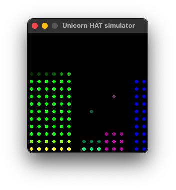

# JoeSolarPi

## Summary

This is a python app to run on a Raspberry Pi with a UnicornHat HD (at 16 x 16 LED array) to visualize data from a SolarEdge solar system. You can also run using the Unicorn Hat simulator on any system.

To use with your SolarEdge system, you will need your site_id and knowing that you will need to obtain an api_key, which you can do after logging into the SolarEdge monitoring site: https://monitoring.solaredge.com/

The exact steps for obtaining the api_key may change, so google it if you can't find. If you are system owner, you should have no trouble getting an api_key once you log in.

API Guide: https://www.solaredge.com/sites/default/files/se_monitoring_api.pdf

Here is more information about the Primori Unicorn Hat HD that I am using: https://github.com/pimoroni/unicorn-hat-hd

## Requirements
On the Raspberry Pi, you will want to do the full install of the pimoroni unicorn hat stuff. As of the time of this writing, that is this:

```
 curl https://get.pimoroni.com/unicornhathd | bash
```

To run and/or debug on a non-raspberry system, install the simulator module (https://github.com/jayniz/unicorn-hat-sim) with pip or whatever python package manager you use:
```
pip install unicorn-hat-sim
```

You will also need the following python modules - I think these are pretty standard and it is unlikely you'll need to install anything.

- import requests
- import json
- from datetime import date
- from datetime import datetime
- from datetime import timedelta
- import urllib.parse
- import time
- import copy
- import configparser
- import os.path
- import logging

## Config
The code first looks for "MyJoeSolarPi.config" and if not found looks for JoeSolarPi.config. There is a script, configWriter.py, which will generate the defaul config file. Copy the default config file and edit it to set your site_id and api_key values. Make any other changes as you see fit.

In particular, check the "rotation" value in the Display section if the bars it is showing aren't vertical. (For the simulator, the rotation value in the config is not used.) You will also want to set values in KW an KWH in the PVSettings section to scale the bars. You'll want pvpower to be the max KW that your system will produce, and maxEnergy to be the max it will produce in a day to make best use of the screen area.

## Operation
Run it as any other python script. Dots should blink across the top of the Unicorn Hat to indicate it's getting data. Once it has the data, it should render it. Errors encountered will be written to a log file in the same folder. 



The left columns show current production and usage. Default production colors are green, usage red. Self-consumption will show as a mix of the colors, which is yellow by default. Columns shift to the left at the refresh rate (default 120 seconds) and a new column of current values is drawn at the right of the section.

The middle section shows the total production and total usage for the day with production on the left. A dot above each bar shows the value from the previous day.

The right section show the battery status. If charging, a green bar appears above the batter section. If discharging, a red bar shows at the bottom. The dots of the batter being full brightness shows the percent of the battery's charge.

Every refresh the console will write out the exact values it downloads from SolarEdge.

Best of luck!
